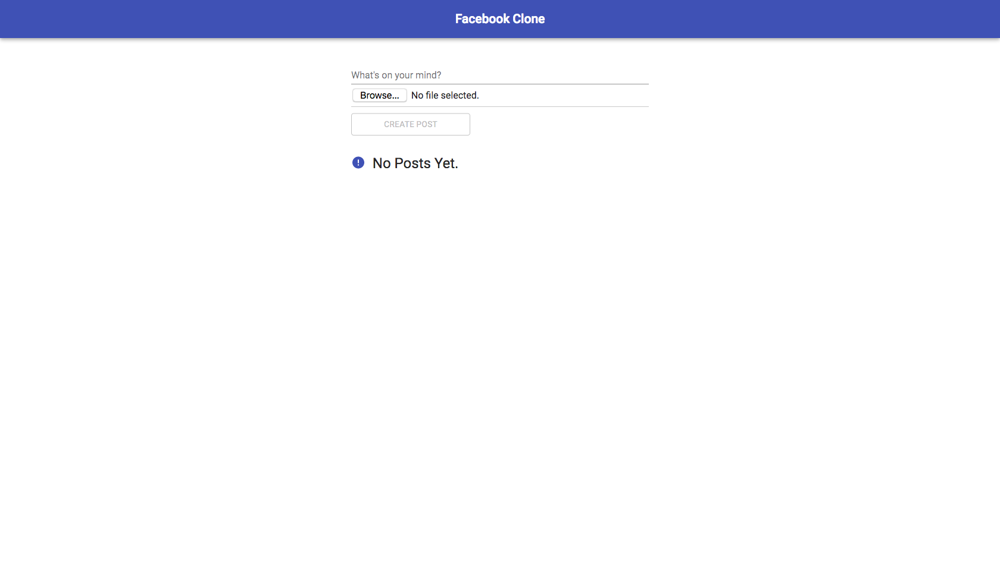
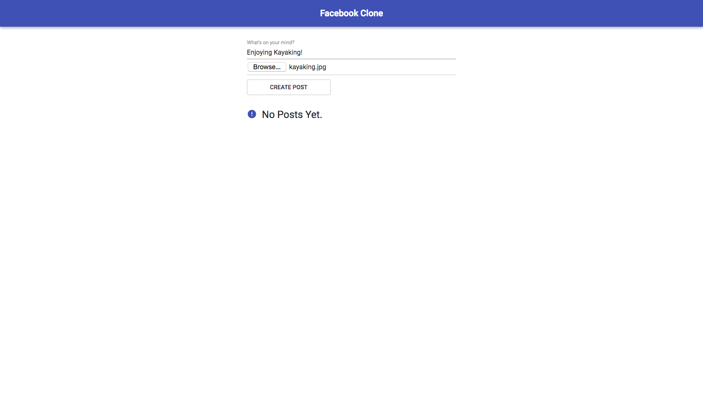
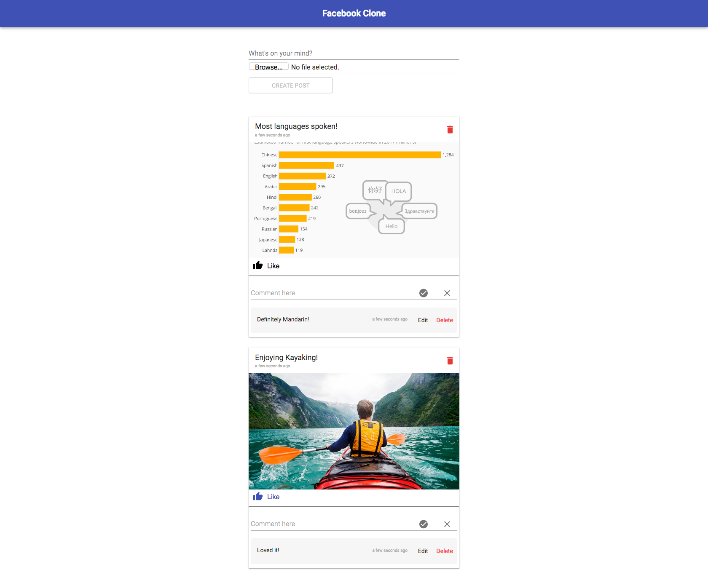
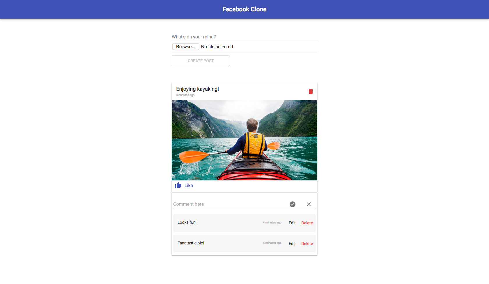

# SETUP INFO

## Backend

1. Install MAMP - https://www.mamp.info/en/downloads/ and start Apache server
2. Change database configs in `backend/src/util/db.js` - Username and Password
3. import `social_media.sql` in phpmyadmin to create required database and tables.
3. `npm install`
4. `npm start`

## Frontend

1. `npm install`
2. `npm start`

## Screenshots of application

## No Posts
# 

## Create Post
# 

## Feed
# 

## Comments
# 

